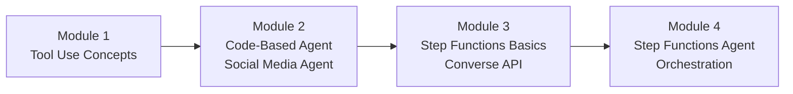
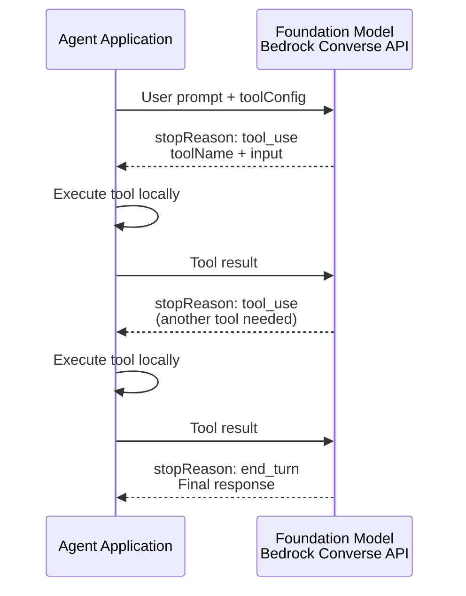
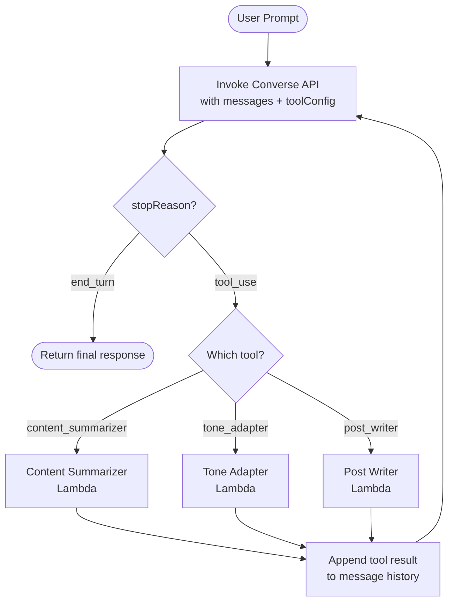
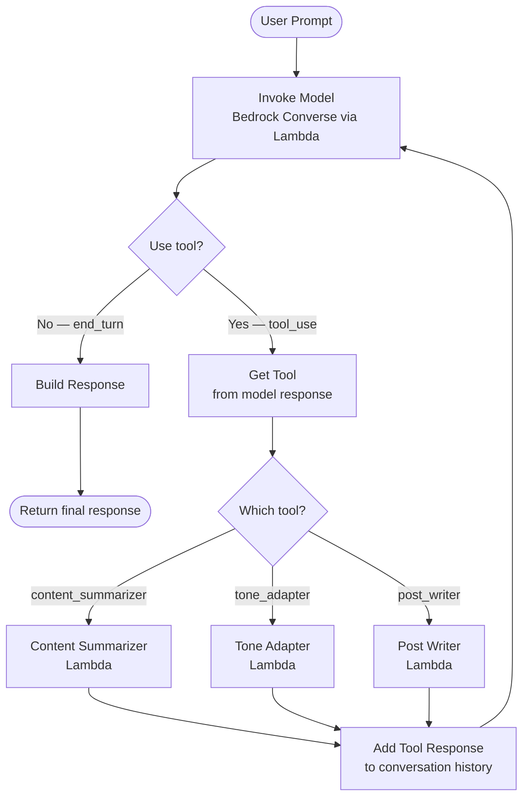
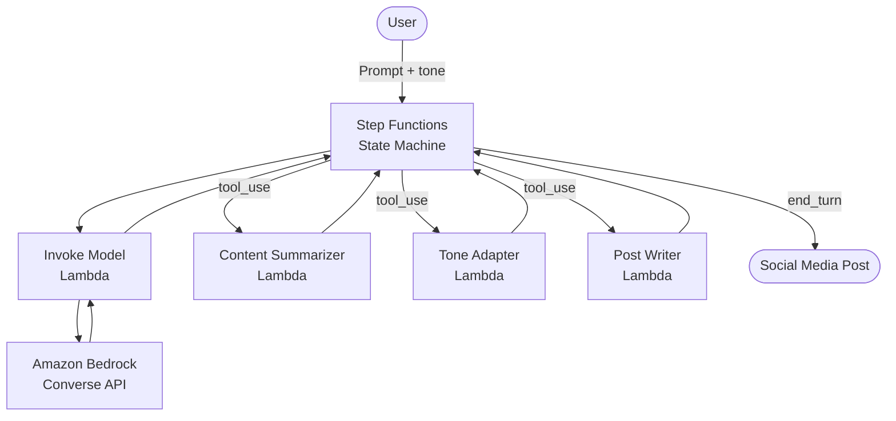

# Agentic Workflows with Step Functions — Flow Diagrams

## Module Progression



## Tool Use — Request/Response Cycle



## Code-Based Agent Loop (Module 2)



## Step Functions Agent Orchestration (Module 4)



## Code-Based vs Step Functions Comparison

```mermaid
graph TD
    subgraph Code-Based<br>Module 2
        CL[Lambda runs agent loop]
        CL --> CB[Bedrock Converse API]
        CL --> CT[Tool Lambdas]
        CL -.->|Pays for idle<br>compute time| CL
    end

    subgraph Step Functions<br>Module 4
        SF[State Machine orchestrates]
        SF --> SB[Invoke Model State<br>Bedrock via Lambda]
        SF --> SD{Use tool? Choice State}
        SD --> ST[Tool Lambda States]
        ST --> SA[Add Tool Response State]
        SA --> SB
        SF -.->|Pauses between steps<br>no idle cost| SF
    end
```

## Full Architecture — Social Media Agent


