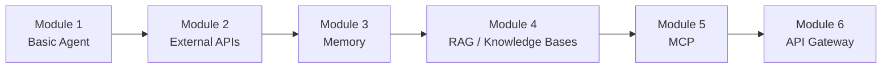
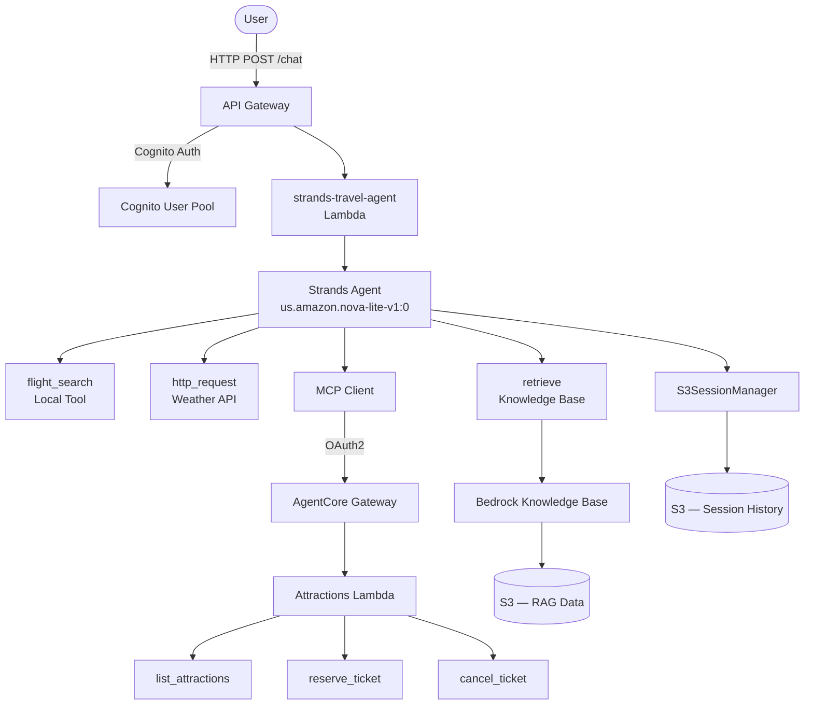
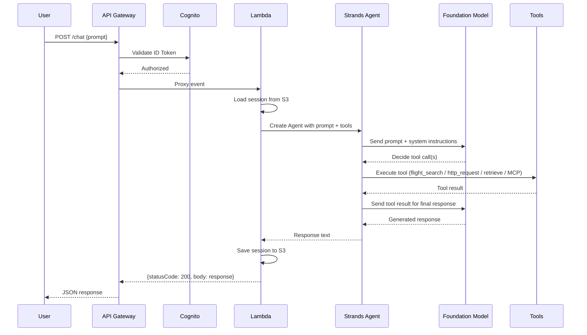
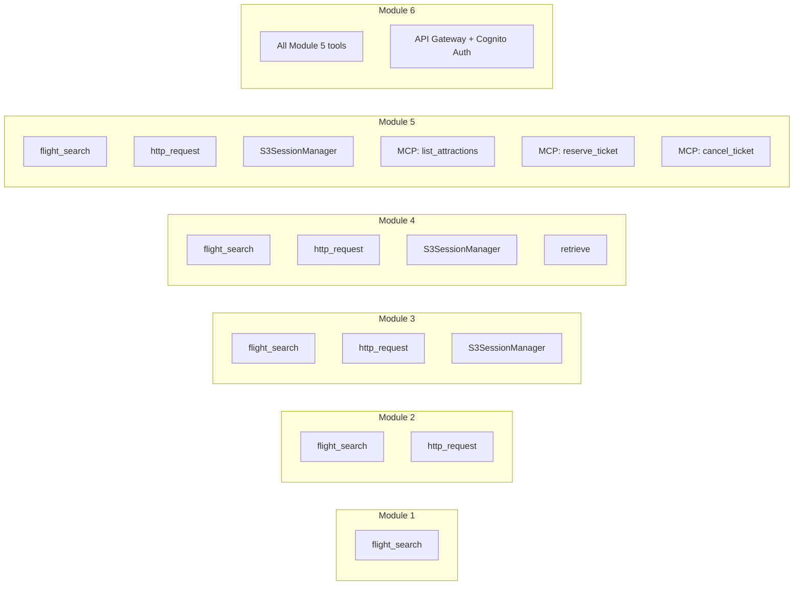

# Strands Travel Agent — Flow Diagrams

## Module Progression

```mermaid
graph LR
    M1[Module 1<br>Basic Agent] --> M2[Module 2<br>External APIs]
    M2 --> M3[Module 3<br>Memory]
    M3 --> M4[Module 4<br>RAG / Knowledge Bases]
    M4 --> M5[Module 5<br>MCP]
    M5 --> M6[Module 6<br>API Gateway]
```

## Architecture Overview (Final State)

```mermaid
graph TD
    User([User]) -->|HTTP POST /chat| APIGW[API Gateway]
    APIGW -->|Cognito Auth| Cognito[Cognito User Pool]
    APIGW --> Lambda[strands-travel-agent<br>Lambda]

    Lambda --> Agent[Strands Agent<br>us.amazon.nova-lite-v1:0]

    Agent --> FS[flight_search<br>Local Tool]
    Agent --> HTTP[http_request<br>Weather API]
    Agent --> Retrieve[retrieve<br>Knowledge Base]
    Agent --> MCP[MCP Client]

    MCP -->|OAuth2| Gateway[AgentCore Gateway]
    Gateway --> Attractions[Attractions Lambda]
    Attractions --> ListAttr[list_attractions]
    Attractions --> Reserve[reserve_ticket]
    Attractions --> Cancel[cancel_ticket]

    Retrieve --> KB[Bedrock Knowledge Base]
    KB --> S3RAG[(S3 — RAG Data)]

    Agent --> Session[S3SessionManager]
    Session --> S3Sess[(S3 — Session History)]
```

## Agent Request Flow

```mermaid
sequenceDiagram
    participant U as User
    participant API as API Gateway
    participant C as Cognito
    participant L as Lambda
    participant A as Strands Agent
    participant FM as Foundation Model
    participant T as Tools

    U->>API: POST /chat {prompt}
    API->>C: Validate ID Token
    C-->>API: Authorized
    API->>L: Proxy event
    L->>L: Load session from S3
    L->>A: Create Agent with prompt + tools
    A->>FM: Send prompt + system instructions
    FM-->>A: Decide tool call(s)
    A->>T: Execute tool (flight_search / http_request / retrieve / MCP)
    T-->>A: Tool result
    A->>FM: Send tool result for final response
    FM-->>A: Generated response
    A-->>L: Response text
    L->>L: Save session to S3
    L-->>API: {statusCode: 200, body: response}
    API-->>U: JSON response
```

## Tool Capabilities by Module

```mermaid
graph LR
    subgraph Module 1
        T1[flight_search]
    end
    subgraph Module 2
        T2[flight_search]
        T3[http_request]
    end
    subgraph Module 3
        T4[flight_search]
        T5[http_request]
        T6[S3SessionManager]
    end
    subgraph Module 4
        T7[flight_search]
        T8[http_request]
        T9[S3SessionManager]
        T10[retrieve]
    end
    subgraph Module 5
        T11[flight_search]
        T12[http_request]
        T13[S3SessionManager]
        T14[MCP: list_attractions]
        T15[MCP: reserve_ticket]
        T16[MCP: cancel_ticket]
    end
    subgraph Module 6
        T17[All Module 5 tools]
        T18[API Gateway + Cognito Auth]
    end
```
