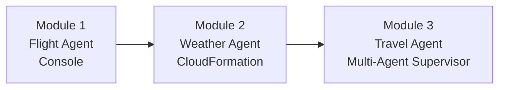
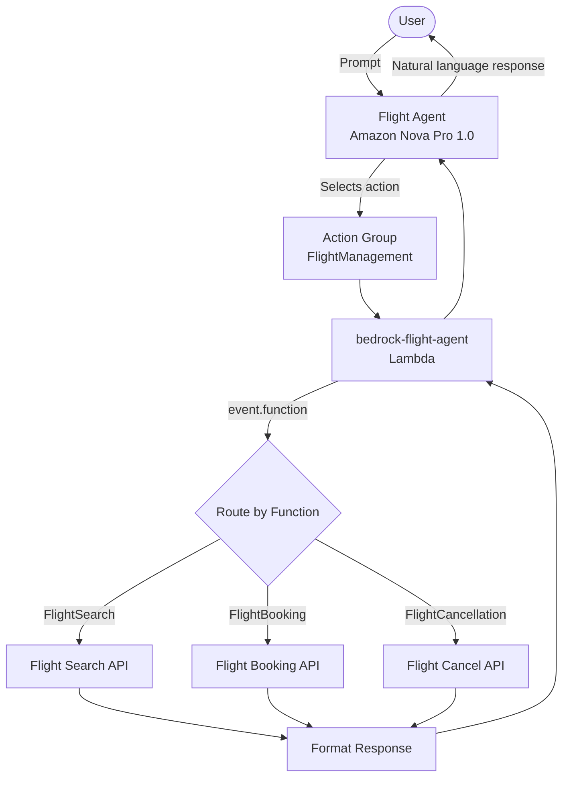
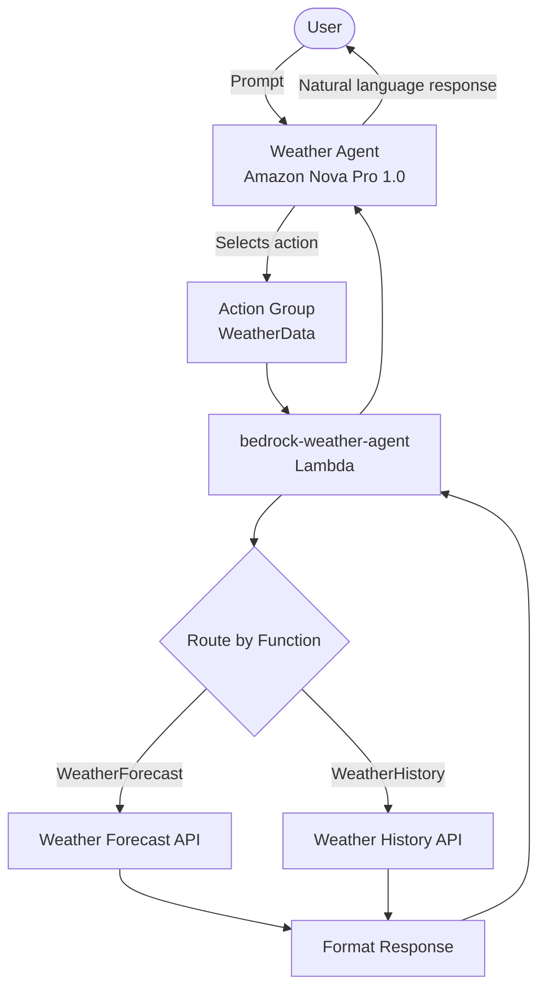
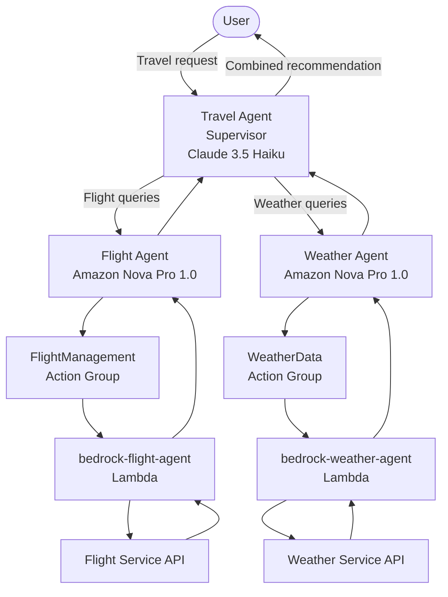
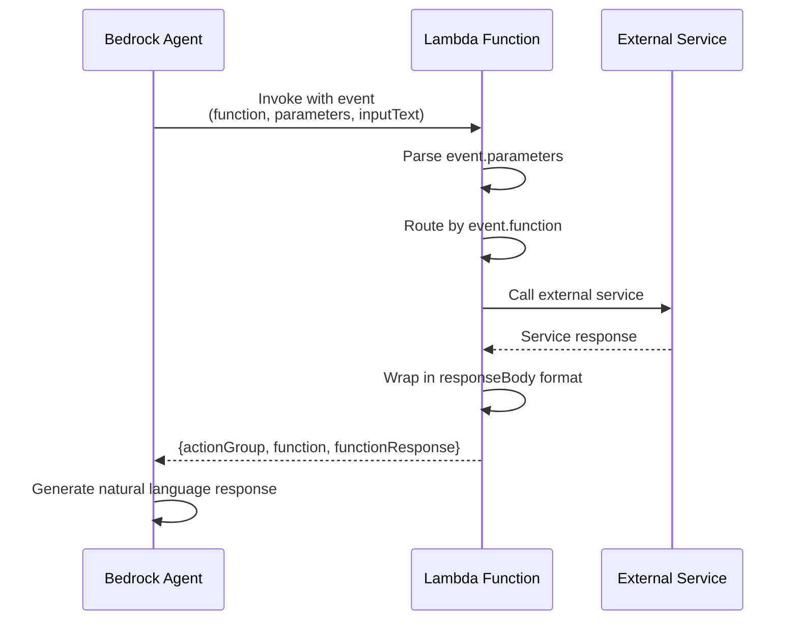
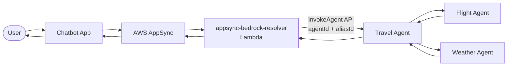
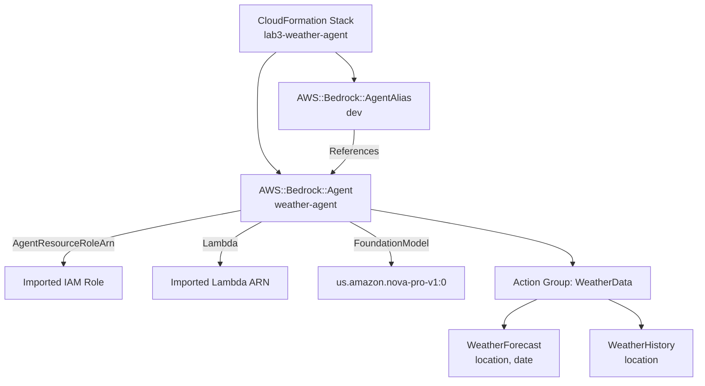

# Bedrock Agents — Flow Diagrams

## Module Progression

## Flight Agent — Single Agent Flow

## Weather Agent — Single Agent Flow

## Multi-Agent — Travel Agent Supervisor

## Lambda Action Fulfillment Flow

## Chatbot Application Flow (Module 3)

## CloudFormation Deployment (Weather Agent)

